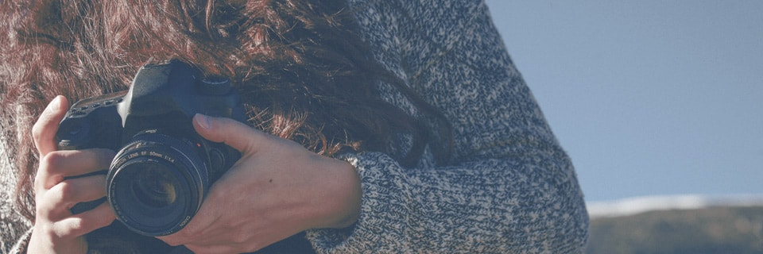
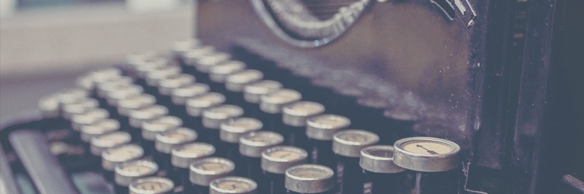

<h3 class="major">The Bride</h3>

Salamah 24 years old, the first child of 2 siblings. She graduated from University of Manchester with an Architecture degree. She loves shiny blue clear water and enjoy going to the beach, she finds listening to the waves very therapeutic. When she has free time she likes setting up small events for her friends and family for any small occasion and canʼt get over DIY deco. It lighten her mood when ever she sees flower and plants, especially orchids, hydrangeas and peonies. Salamah has no talking with people of all types and modes because she get energised by socialising.

<h3 class="major">The Groom</h3>

Luqman Rashdi 26 years old, the third child of six siblings. He graduated from University Technology Mara with an Interior Architecture degree. He is known as the ‘Handy-Manʼ around his friends and family, enjoy helping others. He is very passionate in his career hence he and 4 other friends opened up a design and construct company. An athletic person with a big appetite. Also When Ridzwan is not working he loves to go for long hikes up the mountain. Ridzwan has a soft heart when ever he is around cats, definitely a cat person. Ridzwan is a very shy and reserve person but once he gets comfortable with you he will be quite a chatter. Silly ass motherfucker.
